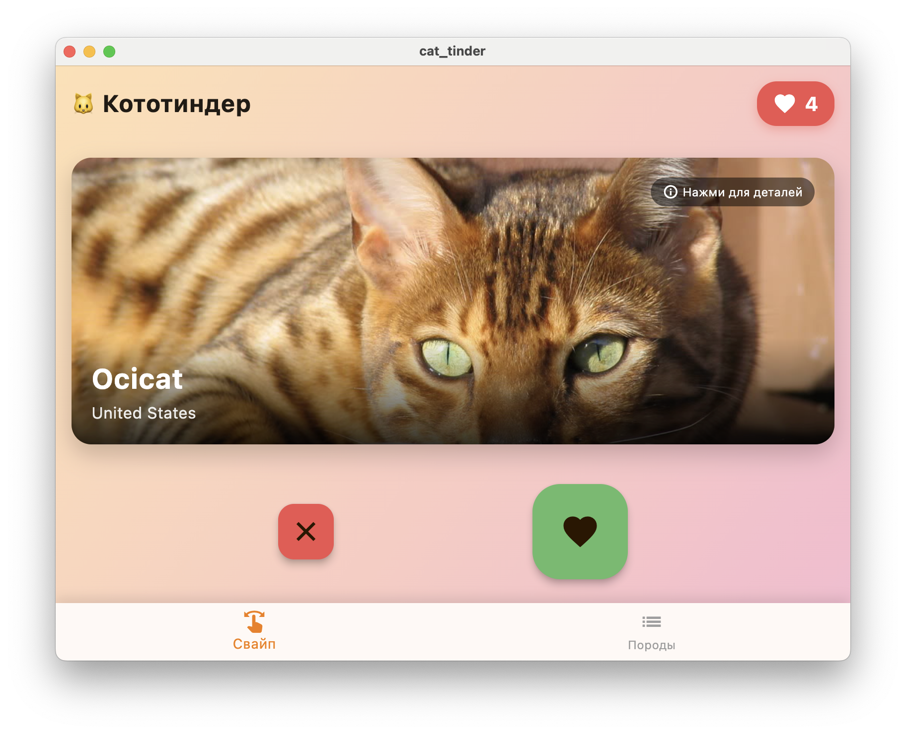
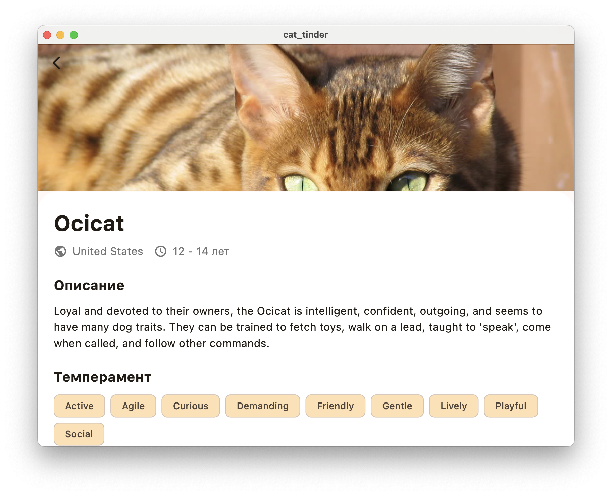
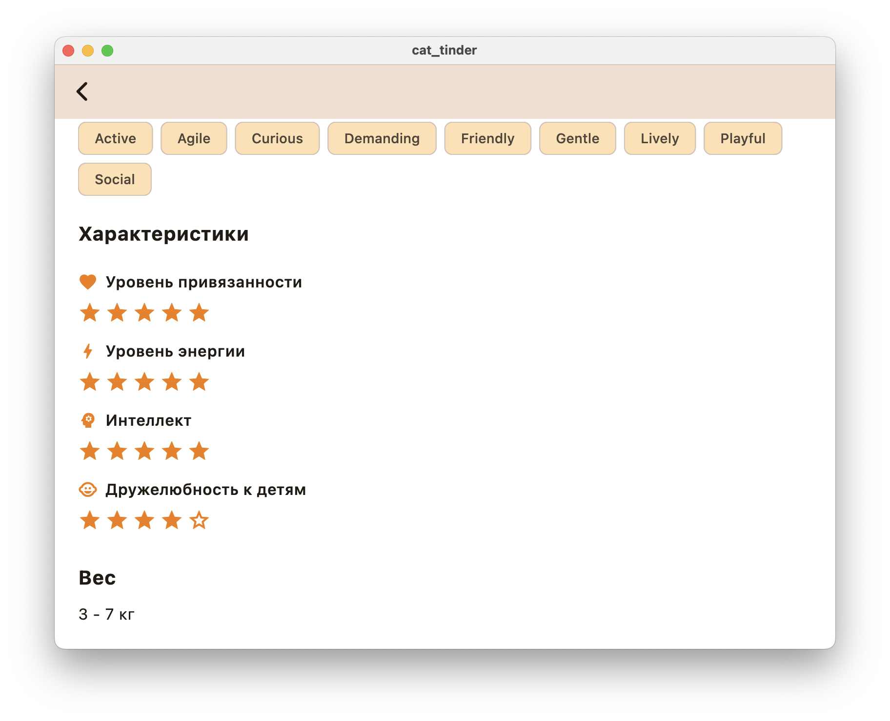
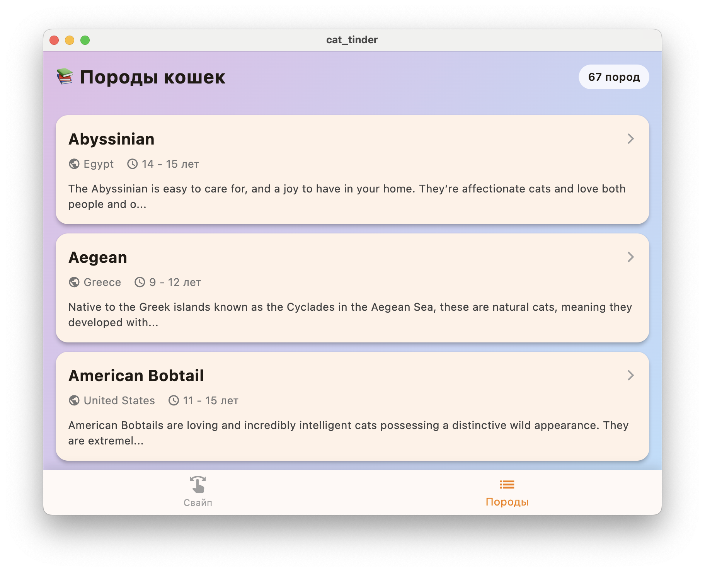
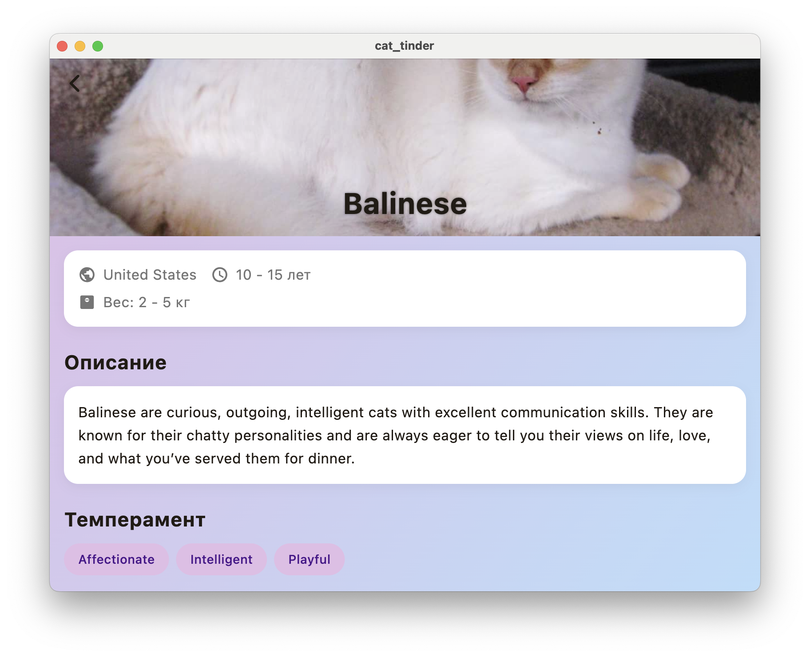
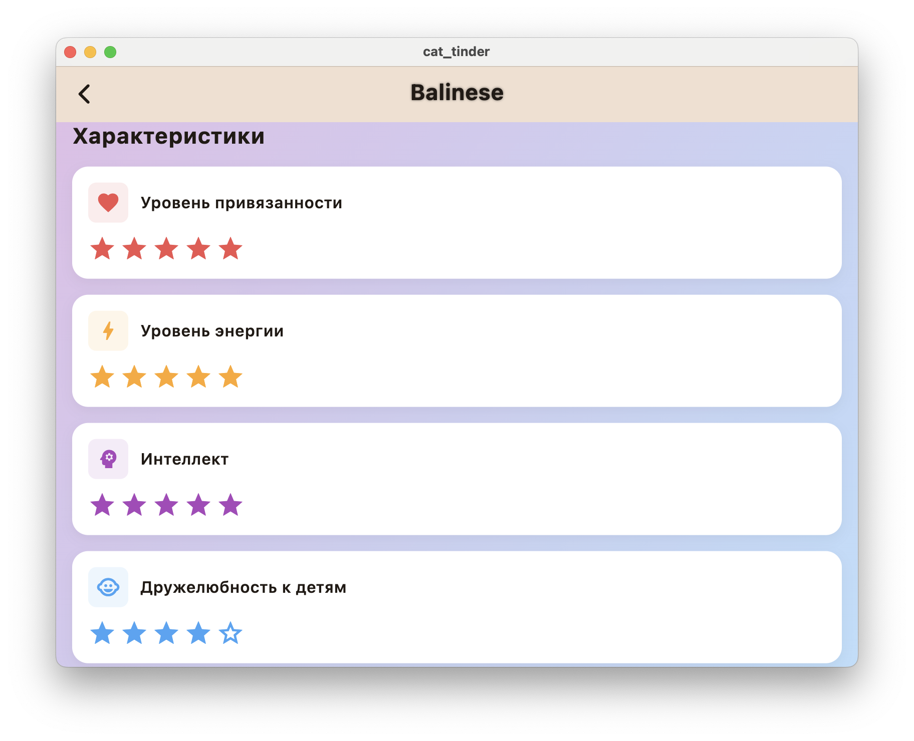

# Кототиндер (Cat Tinder)

Мобильное приложение для просмотра и оценки фотографий котиков с информацией о породах. Свайпайте котиков, изучайте породы и собирайте лайки!

## Реализованные функции

- **Главный экран со свайпами** — отображение случайных изображений котиков с названием породы
- **Свайп-жесты** — смахивание влево (дизлайк) или вправо (лайк)
- **Кнопки лайк/дизлайк** — альтернативный способ оценки котиков
- **Счетчик лайков** — отображение и сохранение количества лайкнутых котиков
- **Детальная информация о котике** — полноэкранный просмотр с описанием породы
- **Список пород** — просмотр всех доступных пород с краткой информацией
- **Детальная информация о породе** — описание и характеристики породы (уровень привязанности, энергии, интеллект, дружелюбность к детям)
- **Таб-навигация** — переключение между экраном свайпов и списком пород

## Скриншоты

### Главный экран

### Просмотр котика

### Характеристики котика

### Список пород

### Информация о породе

### Характеристики породы

## Скачать приложение
Ссылка на скачивание [APK](https://github.com/Lledely/cat-tinder/releases/download/v.1/app-release.apk)